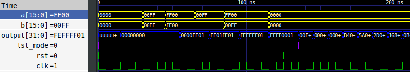

# MAC_Unit
Intro to GHDL with a basic Multiply and Accumulate with Build in Self Test (BIST)

## Prerequisite packages install script
```
sudo apt update
sudo apt install -y git make gnat zlib1g-dev
git clone https://github.com/ghdl/ghdl
cd ghdl
./configure --prefix=/usr/local
make
sudo make install
echo "$0: All done!"
sudo apt install gtkwave
```

## Clone project and test design
```
git clone https://github.com/ErezBinyamin/MAC_Unit.git
cd MAC_Unit
make test TESTBENCH=./tst/BIST_MAC_TB.vhd
```

## Test intermediary components
- N-bit adder: ```make test TESTBENCH=./tst/Full_Adder_Nbit_TB.vhd```  
- N-bit Multiplier: ```make test TESTBENCH=./tst/Multiplier_TB.vhd```  
- MAC unit: ```make test TESTBENCH=./tst/MAC_TB.vhd```  
- BIST-MAC ```make test TESTBENCH=./tst/BIST_MAC_TB.vhd```  

## GTK-wave simulation output


## Project Structure
> **work** - contains project components  
> > A.vhd  
> > B.vhd  

> **tst** - contains testbenches for each component  
> > A_TB.vhd  
> > B_TB.vhd  

> **out** - contains output artifacts from builds  
> **report** - contains files needed for final report  

## Build system
Using `ghdl -s` for syntax checks and `ghdl -a` for compilation, all `.vhd` files are checked/compiled using the first generic target.
Using `ghdl -r` for simulations, all `.vhd` testbenches can be simulated into `.vcd` files. The testbench entity name must match the testbench filename.
