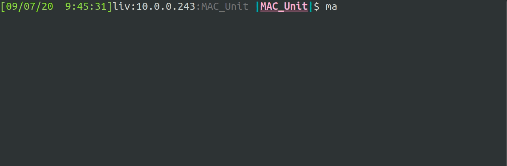

# MAC_Unit
Intro to GHDL with a basic Multiply and Accumulate with Build in Self Test (BIST)

## Prerequisite packages install script
```
sudo apt update
sudo apt install -y git make gnat zlib1g-dev
git clone https://github.com/ghdl/ghdl
cd ghdl
./configure --prefix=/usr/local
make
sudo make install
echo "$0: All done!"
sudo apt install gtkwave
```

## Clone project and test design
```
git clone https://github.com/ErezBinyamin/MAC_Unit.git
cd MAC_Unit
make test TESTBENCH=./tst/BIST_MAC_TB.vhd
```

## Test intermediary components
- N-bit adder: ```make test TESTBENCH=./tst/Full_Adder_Nbit_TB.vhd```  
- N-bit Multiplier: ```make test TESTBENCH=./tst/Multiplier_TB.vhd```  
- MAC unit: ```make test TESTBENCH=./tst/MAC_TB.vhd```  
- BIST-MAC ```make test TESTBENCH=./tst/BIST_MAC_TB.vhd```  

## GTK-wave simulation output


---
## Auto RTL documentation using [graphviz dot](https://graphviz.gitlab.io/download/)
- Use ```make dot_template``` to auto-gen a template file in ```out/rtl.dot```  
- Use ```make dot``` to compile ```out/rtl.dot``` into ```out/rtl.png``` and ```display``` it  


## Project Structure


> **work** - contains project components organized in dependency structure
> > A.vhd  
> > B.vhd  


> > **\[FRUIT_DEPENDENCY\]**  - some dependency needed to compile A.vhd and B.vhd
> > > apple.vhd  
> > > grapes.vhd  


> > **\[VEGGIE_DEPENDENCY\]**  - some dependency needed to compile A.vhd and B.vhd
> > > cucumber.vhd  
> > > corn.vhd  

> **tst** - contains testbenches for each component  
> > A_TB.vhd  
> > B_TB.vhd  

> **out** - contains output artifacts from builds  
> **report** - contains files needed for final report  
---

## Build system
- Put new source code in [work](https://github.com/ErezBinyamin/MAC_Unit/tree/master/work)  
- Pus new testbenches in [tst](https://github.com/ErezBinyamin/MAC_Unit/tree/master/tst)  
- The [Makefile](https://github.com/ErezBinyamin/MAC_Unit/blob/master/Makefile) `make all` rule will find all of the source files in [work](https://github.com/ErezBinyamin/MAC_Unit/tree/master/work), syntax check them `ghdl -s` and compile them `ghdl -a  
- Dependency management between source files is resloved with a [Makefile](https://github.com/ErezBinyamin/MAC_Unit/blob/master/Makefile) enforced **Project Structure**. All dependent source files must exist in subfolders *beneath* the *higher* level components that depend upon them  
- The [Makefile](https://github.com/ErezBinyamin/MAC_Unit/blob/master/Makefile) will call [get_dep_list.sh](https://github.com/ErezBinyamin/MAC_Unit/blob/master/get_dep_list.sh) to generate an ordered list of dependencies based upon the **Project Structre** and compile targets in the correct order.
